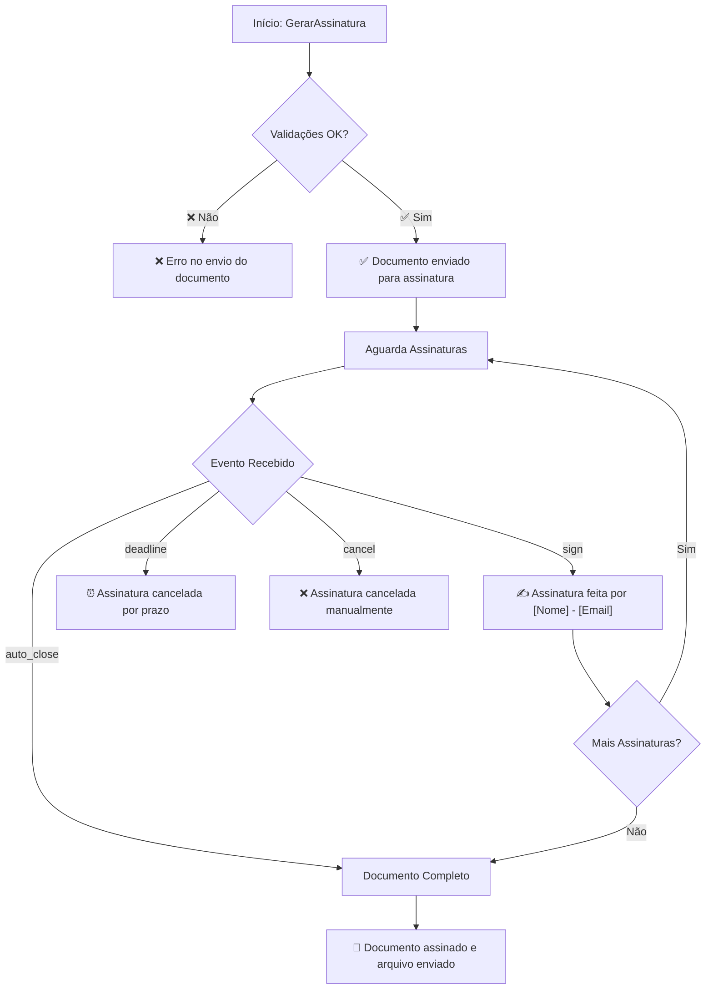

# 📋 Documentação - Mensagens ClickSign Controller

## 🎯 **VISÃO GERAL**

Este documento detalha todas as mensagens enviadas para o Bitrix durante o fluxo de assinatura eletrônica via ClickSign, incluindo momentos específicos e códigos de referência.

---

## 🔄 **FLUXO COMPLETO DE MENSAGENS**

### **Fase 1: Criação da Assinatura** (`GerarAssinatura`)

| **Status** | **Situação** | **Mensagem** | **Código (Linha)** |
|------------|--------------|--------------|-------------------|
| ❌ **ERRO** | Dados faltantes nos signatários | `"Dados faltantes nos signatários (papel)"` | 138 |
| ❌ **ERRO** | Falha ao converter arquivo | `"Erro no envio do documento para assinatura"` | 338 |
| ❌ **ERRO** | Falha geral na criação | `"Erro no envio do documento para assinatura"` | 338 |
| ✅ **SUCESSO** | Documento criado com sucesso | `"Documento enviado para assinatura"` | 301, 337 |
| ⚠️ **PARCIAL** | Criado mas erro no banco | `"Assinatura criada, mas falha ao gravar no banco"` | 311 |

### **Fase 2: Eventos de Callback** (`retornoClickSign`)

#### **✍️ Evento: `sign` - Assinatura Realizada**
| **Situação** | **Mensagem** | **Formato** | **Código** |
|--------------|--------------|-------------|------------|
| ✅ **Assinado** | `"Assinatura feita por [NOME] - [EMAIL]"` | Ex: "Assinatura feita por João Silva - joao@email.com" | 442 |

#### **⏰ Evento: `deadline` - Prazo Expirado**
| **Situação** | **Mensagem** | **Código** |
|--------------|--------------|------------|
| ⚠️ **Expirado** | `"Assinatura cancelada por prazo finalizado."` | 479 |

#### **❌ Evento: `cancel` - Cancelamento Manual**
| **Situação** | **Mensagem** | **Código** |
|--------------|--------------|------------|
| ⚠️ **Cancelado** | `"Assinatura cancelada manualmente."` | 480 |

#### **📄 Evento: `document_closed` - Documento Finalizado**
| **Situação** | **Mensagem** | **Código** |
|--------------|--------------|------------|
| ✅ **Arquivo Anexado** | `"Documento assinado e arquivo enviado para o Bitrix."` | 581 |

---

## 🕐 **CRONOLOGIA DO FLUXO**



---

## 📍 **LOCALIZAÇÃO NO CÓDIGO**

### **Método Principal: `atualizarRetornoBitrix`**
- **Localização**: Linha 332
- **Função**: Centraliza todas as atualizações de mensagem no Bitrix
- **Parâmetros**:
  - `$mensagemCustomizada`: Mensagem específica do contexto
  - `$sucesso`: Boolean para determinar sucesso/erro

### **Mensagens Padrão Definidas**
```php
// Linha 337-338
$mensagemRetorno = $mensagemCustomizada ?? "Documento enviado para assinatura";
$mensagemErro = "Erro no envio do documento para assinatura";
```

---

## 🎯 **PONTOS DE ATUALIZAÇÃO NO BITRIX**

### **1. Durante Criação (`GerarAssinatura`)**
| **Linha** | **Situação** | **Parâmetros Enviados** |
|-----------|--------------|-------------------------|
| 153 | Erro validação signatários | `sucesso: false, documentKey: null` |
| 187 | Erro conversão arquivo | `sucesso: false, documentKey: null` |
| 301 | Sucesso total | `sucesso: true, documentKey: [ID]` |
| 311 | Sucesso parcial | `sucesso: true, documentKey: [ID]` |

### **2. Durante Callbacks (`retornoClickSign`)**
| **Linha** | **Evento** | **Ação** |
|-----------|------------|----------|
| 445-451 | `sign` | Atualiza com nome/email do assinante |
| 482-490 | `deadline/cancel` | Atualiza com mensagem de cancelamento |
| 580-582 | `document_closed` | Anexa arquivo + mensagem final |

---

## 🔧 **CONFIGURAÇÃO DE CAMPOS**

### **Campos Necessários no Bitrix**
- `retorno`: Campo de texto para mensagens de status
- `idclicksign`: Campo para armazenar ID do documento ClickSign
- `arquivoassinado`: Campo de arquivo para documento final

### **Mapeamento de Parâmetros**
```php
$campoRetorno = $params['retorno'] ?? null;
$campoIdClickSign = $params['idclicksign'] ?? null;
```

---

## 📊 **ESTADOS POSSÍVEIS DO DOCUMENTO**

| **Estado** | **Descrição** | **Próxima Ação** |
|------------|---------------|-------------------|
| **Criado** | Documento enviado para assinatura | Aguarda assinaturas |
| **Em Assinatura** | Signatários recebendo/assinando | Atualiza a cada assinatura |
| **Completo** | Todas assinaturas coletadas | Anexa arquivo final |
| **Cancelado** | Prazo expirado ou cancelamento manual | Processo finalizado |
| **Erro** | Falha em alguma etapa | Requer intervenção |

---

## 🛠️ **TROUBLESHOOTING**

### **Problemas Comuns**
1. **Campo retorno não encontrado**: Verificar mapeamento de campos
2. **Arquivo não anexado**: Verificar permissões do campo no Bitrix
3. **Mensagens duplicadas**: Sistema tem proteção contra duplicação

### **Logs Importantes**
- Todos os eventos são logados via `LogHelper::logClickSign()`
- Logs incluem document_key para rastreamento
- Erros de API são capturados e logados

---

## 📞 **CONTATOS TÉCNICOS**

- **Sistema**: ClickSign Integration
- **Repositório**: KW24Apps/Apps
- **Arquivo Principal**: `controllers/ClickSignController.php`
- **Última Atualização**: Agosto 2025

---

## 📝 **CHANGELOG**

| **Data** | **Versão** | **Alteração** |
|----------|------------|---------------|
| Ago/2025 | 1.0 | Documentação inicial |

---

*Este documento deve ser atualizado sempre que houver mudanças nas mensagens ou fluxo do sistema.*
